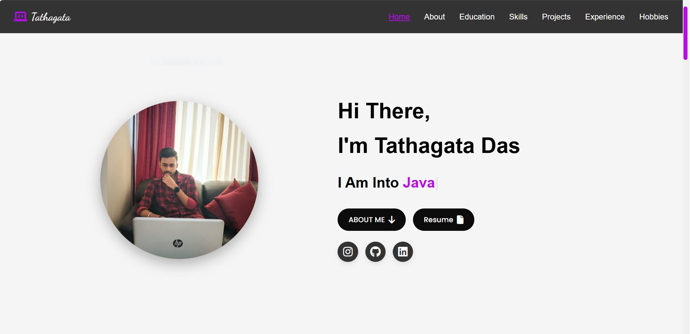
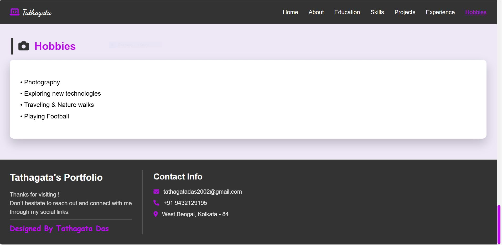

#  Personal Portfolio Website

Welcome to my personal portfolio website repository!  
This site showcases who I am, my skills, education, experience, projects, and how to get in touch with me.

---

##  About the Project

This is a **responsive, modern personal portfolio website** built with **HTML** and **CSS**.  
It’s designed to help me share my background, showcase my work, and connect with others online.

---

##  Features

- Fully Responsive: Looks great on desktop, tablet, and mobile devices.
- Modern Design: Clean layout with attractive sections and smooth scrolling.
- Hero Section: Engaging intro with dynamic text and profile picture.
- About, Education, Skills, Projects, Experience, Hobbies: Well-organized sections to showcase your journey.
- Downloadable Resume: Visitors can easily view or download your resume.
- Social Links: Connect with Instagram, GitHub, LinkedIn.
- Contact Info: Clear and accessible contact section in the footer.
- Deployed on GitHub Pages: Easy to access and share via live link.

---

## 🛠️ Built With

- **HTML**
- **CSS**
- **Java Script**

---

# Screenshots

Include some screenshots showcasing different sections of your website.




---

## 📂 Folder Structure

```
├── index.html
├── style.css
├── profile_pic.jpg
├── Resume.pdf (optional)
├── script.js (optional, if using any JS)
```
    
---

## 🚀 How to Use

1. **Clone the repository**
   ```bash
   git clone https://github.com/your-username/your-portfolio-repo.git

## Contact

-📧 Email: tathagatadas2002@gmail.com

-📞 Phone: +91 9432129195

-📍 Location: West Bengal, Kolkata - 84

